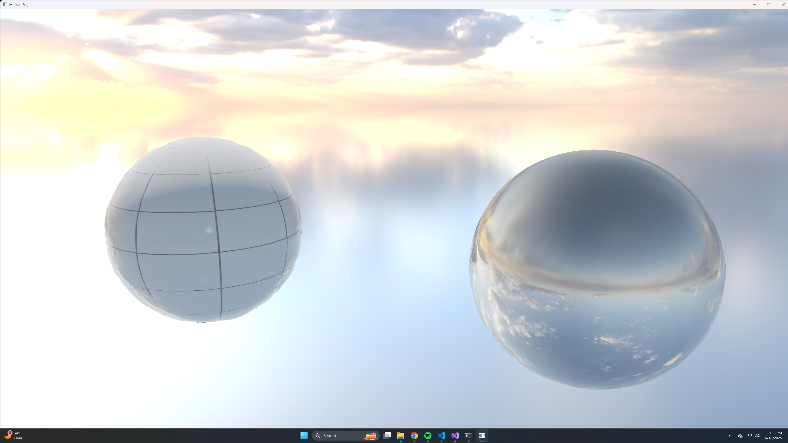

# MulkanEngine (Work In Progress)

## 🚀 Overview

### What is it?
- MulkanEngine is a fundamental 3D real-time rendering engine built from scratch using the VulkanSDK. Currently it establishes a robust Vulkan rendering pipeline, manages essential resources, and provides interactive camera control to navigate a basic scene. The next major mileston einvolves implementing comprehensive scene management and loading more complex 3D models.
- Note that the engine is using Y-Up coordinate system.

## Current Focus:
- The immediate focus is on creating a solid foundation for real-time graphics, emphasizing correct Vulkan usage, robust resource management, and interactive camera movement.

## Key Achieved Features:
- **Core Vulkan Instance & Device Setup**: Initialization of Vulkan API, physical/logical device selection, queue family management.
- **Swapchain Management**: Dynamic swapchain creation, recreation on window resize.
- **Render Pass & Framebuffer Setup**: Basic rendering pipeline with clear attachments.
- **Graphics Pipeline Creation**: Vertex and fragment shader compilation, input assembly, rasterization, depth testing.
- **Resource Management**: Vertex/index buffers, uniform buffers.
- **Descriptor Set Management**: Basic descriptor set layouts and updates for camera uniforms.
- **Interactive Camera System**: Free-look camera (first-person/fly-through) with keyboard movement and mouse look, supporting perspective projection.
- **Basic Primitive rendering**: Rendering Mesh + Texture objects.
- **Validation Layer Integration**: Robust error checking during development.
- **Rendering multiple objects using dynamic uniform buffers**: enables efficient rendering of multiple objects without duplications.
- **Physically Based Rendering (PBR)**: Higher visual fidelity, compatible only with ORM (ARM) maps.
- **Tessellation for Displacement maps**
- **Wireframe mode**: Runs a separate graphics pipeline for mesh / tessellation debugging. Toggle on / off using 'M' key.
- **HDR Skybox**: Runs on-the-fly offscreen render to convert 2D HDR image into cubemap suitable for skybox.

## Showcase / Visuals

## Technologies Used

- **Graphics API**: VulkanSDK (version)
- **Language**: C++17, GLSL
- **Windowing/Input**: GLFW
- **Math Library**: GLM
- **Debugging/Validation**: Vulkan Validation Layers, RenderDoc (external)
- **Build System**:
- **Texture Loading**: `stb_image`
- **Model Loading**: `tinyobjloader`

## Test Model Sources
- [AmbientCG](https://ambientcg.com/)
- [PolyHaven](https://polyhaven.com/)

## 📦 Getting Started

## 🏗️ Architecture (Early Insights)

### VulkanEngine:
- `VulkanEngine` serves as the central hub, owning all the core Vulkan componets via `std::unqiue_ptr`, ensuring proper and automatic resource cleanup (RAII).

### Responsibilities logically divided into discrete classes:
- **Core Setup:** `VulkanInstance`, `VulkanSurface`, `VulkanDevice`
- **Presentation:** `Window`, `VulkanSwapChain`
- **Pipeline & shaders:** `VulkanRenderPass`, `VulkanDescriptorSet`, `VulkanPipelineLayout`, `VulkanGraphicsPipeline`
- **Memory & Resources:** `VulkanVertexBuffer`, `VulkanIndexBuffer`, `VulkanUniformBuffers`, `VulaknTexture`, `VulkanDepthResources`
- **GPU Commands:** `VulkanCommandPool`, `VulkanCommandBuffers`
- **Synchronization:** `VulkanSyncObjects`

## 🛣️ Roadmap

### Immediate Next Steps:
1. [x] Core Vulkan SDK Integration
2. [x] Model/Texture Loading
3. [x] Camera Movement
4. [x] Basic Scene Management (Multiple Objects)
5. [ ] Physically Based Rendering
    - [x] Material System
        - Albedo: The base color.
        - Normals: TO give surfaces fine-grained detail.
        - Metallic/Roughness: For the core PBR metalness workflow - to define whether a surface is metal or dielectric / how rough or smooth it is.
        - Ambient Occulsion (AO): Pre-calculated Shadows for small crevices to add depth
    - [x] Light Sources
    - [ ] New UBOs: To store an array of lights and their properties, which will be accessible to the fragment shader.
    - [ ] Updated Shaders
6. [ ] Shadow Mapping
7. [ ] Entity-Componet-System (ECS) pattern for defining game objects.

### Future Features:
- Image Based Lighting (IBL)
- Global Illumination (SAAO, Voxel Based GI)
- Shadow Mapping (Cascaded Shadow Maps)
- Post-Processing Effects (Bloom, Tone Mapping, etc)
- Custom Material System
- Compute Shaders for simulations (e.g., particle systems)
- Debugging Tools & UI - `Dear ImGui` integration
- Performance Profiling & Optimization
- Ray Tracing

## 📜 License

## 🧑‍💻 Author
- [Michael Kim](https://www.linkedin.com/in/michaeltk217/)

